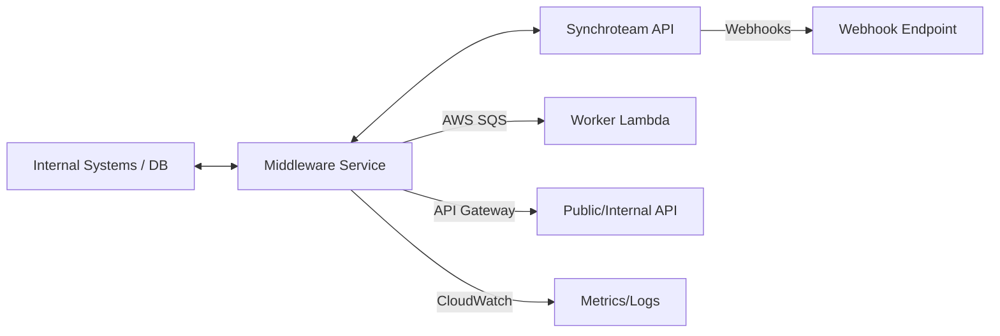

# REQUIREMENTS (Statement of Work) — Synchroteam Integration Middleware

## 1. Executive Summary

This Statement of Work (SOW) defines the requirements, deliverables, and implementation plan for a middleware service that synchronizes data between internal business systems (using PostgreSQL via Entity Framework Core 8) and Synchroteam’s v3 REST API. The solution will be AWS-serverless-first, cost-effective, and extensible for future needs.

---

## 2. Objectives

- Achieve reliable, bi-directional synchronization of core entities (Customers, Sites, Contacts) between internal systems and Synchroteam.
- Minimize manual reconciliation and data drift by leveraging webhooks and scheduled polling.
- Provide a scalable, secure, and maintainable middleware layer deployable with minimal AWS costs.
- Ensure extensibility for additional entities (Jobs, Equipment) and future workflows.

---

## 3. Scope of Work

**In Scope:**
- Design and implementation of a .NET 8 middleware service using EF Core 8.
- Integration with Synchroteam v3 REST API for CRUD/upsert of Customers, Sites, Contacts.
- Consumption of Synchroteam webhooks for event-driven updates.
- Scheduled polling for delta fetches (updatedSince) from Synchroteam.
- ID mapping and conflict resolution logic.
- AWS serverless deployment: Lambda, API Gateway, SQS, Secrets Manager, CloudWatch.
- Security: HTTPS, secret management, authentication/authorization.
- Observability: structured logging, metrics, alarms.

**Out of Scope (Initial Phases):**
- Full-featured admin UI (beyond health/status endpoints).
- Custom Synchroteam plugin development.
- Bulk data migration tooling (beyond bootstrap endpoints).
- Support for non-PostgreSQL internal databases.

---

## 4. Technical Architecture

**High-Level Diagram:**

**Key Modules:**
- **Domain & Data Access:** EF Core 8, PostgreSQL, ID mapping, change tracking.
- **Synchroteam Client:** Typed wrapper for API endpoints, error handling, retries.
- **Middleware API:** Endpoints for push sync, webhook reception, admin/health.
- **Queue/Worker Layer:** SQS-backed job processing, background sync.
- **Scheduler:** EventBridge/Cron triggers for periodic polling.
- **Observability:** CloudWatch logs, metrics, alarms.

---

## 5. Implementation Phases

**Phase 1: Prototype / PoC**

- [X] Build Synchroteam client for Customers, Sites, Contacts.
- [ ] Create minimal push sync endpoint (POST /sync-to-st/customer).
- [ ] Deploy initial AWS stack via CDK.

**Phase 2: Webhooks & Pull Sync**
- [ ] Implement webhook endpoint and processing.
- [ ] Add scheduled polling (delta fetch) per entity.
- [ ] Integrate ID mapping, conflict resolution, error handling, logging.

**Phase 3: Bulk/Bootstrap & Reconciliation**
- [ ] Bulk import endpoint for initial data load.
- [ ] Reconciliation routines for mismatch detection and correction.
- [ ] Admin dashboard/monitoring (CloudWatch dashboards).

**Phase 4: Hardening & Scaling**
- [ ] Circuit breakers, throttling, SLOs, performance profiling.
- [ ] Containerized workers if Lambda constraints are exceeded.
- [ ] Cost optimization review.

---

## 6. Deliverables

| Deliverable                               | Description                                                       |
|-------------------------------------------|-------------------------------------------------------------------|
| Middleware Service Source Code            | .NET 8, EF Core 8, AWS Lambda functions, API Gateway handlers     |
| Synchroteam Client Library                | Strongly-typed API wrapper with error/retry handling              |
| Webhook Receiver                          | Secure, validated public endpoint for Synchroteam event ingestion |
| ID Mapping Data Model & Migration         | EF Core entity, migration scripts, and documentation              |
| AWS Infrastructure as Code (CDK)          | Reproducible stack for all AWS resources                          |
| Logging & Monitoring Dashboards           | CloudWatch logs, metrics, alarms, and sample dashboards           |
| CI/CD Pipeline Definition                 | Build, test, deploy pipeline scripts (YAML or CDK pipeline)       |
| Documentation                             | API contracts, architecture diagrams, operational runbooks        |

---

## 7. Security & Compliance

- **Transport:** All endpoints require HTTPS (TLS 1.2+).
- **Authentication:** Internal API secured with API keys/JWT/OIDC (configurable).
- **Webhook Validation:** HMAC signature, shared secret, and/or IP allowlist.
- **Secrets Management:** AWS Secrets Manager or SSM Parameter Store.
- **IAM:** Least privilege for Lambda, SQS, DB, and secrets.
- **Data Protection:** Encrypted at rest and in transit; audit trails for sync events.
- **Reliability:** Dead-letter queues, retries with exponential backoff, circuit breakers.

---

## 8. Monitoring & Maintenance

- **Observability:** Structured logs (correlation IDs, job IDs), metrics (sync throughput, errors, retries).
- **Alarms:** CloudWatch alarms for error rates, DLQ entries, latency, and resource limits.
- **Health Endpoints:** API routes for service health and status.
- **Maintenance:** Automated dependency updates, scheduled Lambda runtime upgrades, regular secret rotation.
- **Support:** Runbooks for incident response and recovery.

---

## 9. Acceptance Criteria

- Middleware service deployed to AWS, passing end-to-end integration tests.
- Synchroteam client exposes CRUD/upsert for Customers, Sites, Contacts.
- Webhook endpoint receives and processes events securely.
- Scheduled polling jobs update internal DB with external changes.
- ID mapping and conflict resolution logic operational and tested.
- Error handling, retries, and DLQ behavior verified.
- Security controls (HTTPS, auth, secrets) in place and validated.
- Logging, metrics, and alarms configured and demonstrable.
- Documentation (API, architecture, runbooks) delivered and reviewed.

---

## 10. Estimated Costs

| Component              | AWS Service        | Cost Notes                              |
|------------------------|-------------------|------------------------------------------|
| Compute                | Lambda            | Pay-per-use; minimal for low volume      |
| API Exposure           | API Gateway       | $3.50/million requests (REST)            |
| Queueing               | SQS               | $0.40/million requests                   |
| Storage                | RDS/PostgreSQL    | Use existing or Aurora Serverless v2     |
| Secrets                | Secrets Manager   | $0.40/secret/month                       |
| Monitoring             | CloudWatch        | Included up to free tier                 |
| Infra as Code          | CDK               | No extra cost                            |

**Estimated monthly AWS cost (low volume):** $20–$60, depending on DB size and traffic.

---

## 11. Future Enhancements

- Support for additional Synchroteam entities (Jobs, Equipment, etc.).
- Bulk data migration and advanced reconciliation tools.
- Fine-grained RBAC and multi-tenant support.
- Enhanced admin UI for monitoring and reconciliation.
- Integration with other business systems (CRM, ERP, etc.).
- Automated scaling and performance optimization.

---

## 12. Development Standards

- Use CQRS pattern with MediatR in the Middleware service.
  - All endpoint business operations should be modeled as commands/queries and handled by IRequestHandlers.
  - Avoid putting domain logic in Minimal API route handlers; handlers should delegate to MediatR.
- Validation is mandatory via FluentValidation and runs in the application pipeline.
  - Register validators and a MediatR validation pipeline behavior to fail fast with HTTP 400 on validation errors.
  - Keep validators for both transport models (request DTOs) and command/query models when needed.
- Keep endpoints thin; treat Program.cs as composition root (DI, behaviors, logging).
- Add unit tests around handlers and validators as the solution evolves.
- Follow .NET 8 minimal hosting and nullable reference types enabled.

---
